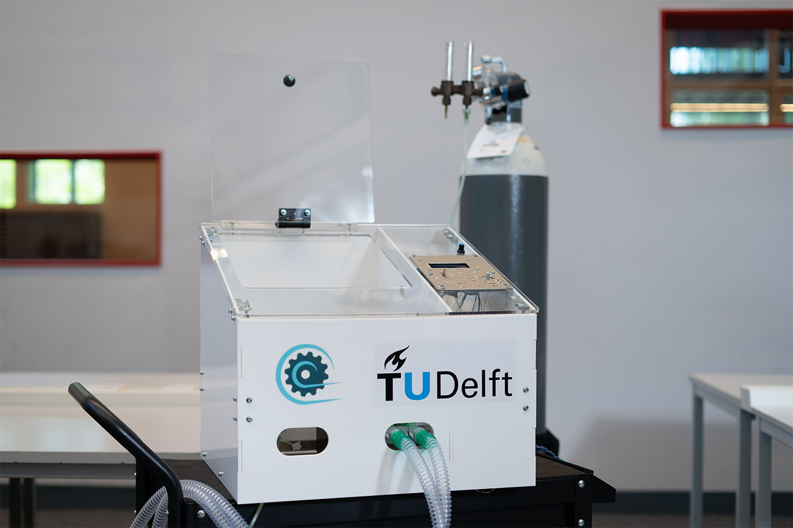

# Project Inspiration Emergency Mechanical Ventilator

## References

More information and contact details can be found on https://projectinspiration.nl

To download the repository: [GitHub DOWNLOAD](https://github.com/CombatCovid/TU-Delft-PI-Emergency-Ventilator/archive/master.zip)

This is the URL of the repository: https://github.com/CombatCovid/TU-Delft-PI-Emergency-Ventilator

## Background

Project Inspiration is one of three teams that are part of Air for All, an umbrella initiative of TU Delft to battle the shortage of medical ventilators during the COVID-19 pandemic.

On the initiative of Dr. Gerwin Smit, a team of researchers and students developed a new ventilator, inspired by the ‘East-Radcliffe’ ventilator. The East-Radcliffe ventilator was used during the 60’s and 70’s in European hospitals, and many years after that in hospitals in low-resource settings. The team borrowed an original East-Radcliffe ventilator from the collection of science museum ‘Boerhaave’, disassembled it and created a new design inspired by the original one. The aim of the project is to develop a mechanical ventilator that can be produced anywhere in the world, both in high-income countries as well as in low-resource settings. An interdisciplinary team of more than 40 people consisting of academic staff, students, and technical support staff is working on the machine while being advised by industry professionals, medical doctors and medical reservists.

## Ongoing work

At the present time, we are working on different segments of the project, which we will be updated and released via this GitHub repository:

-	Hardware functional design (version 1.2 released)
-	Electronics functional design 
-	Software functional design
-	Testing results
-	Compliance with medical Standards (and emergency certification)

## DISCLAIMER
The design is at this time, 18th of May 2020, not certified by any official body for medical use. The design should not be used without proper validation and certification by local authorities.

The design has been partly created with use of a SOLIDWORKS Education Edition. 
